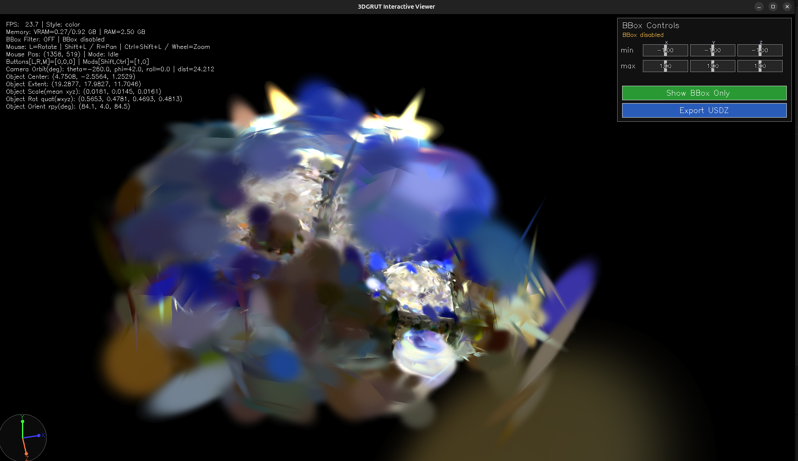
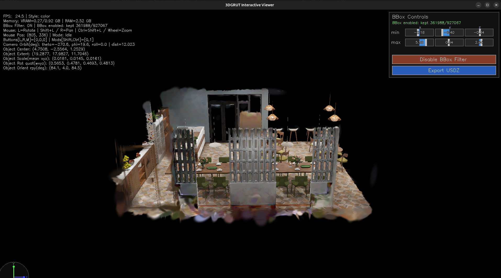
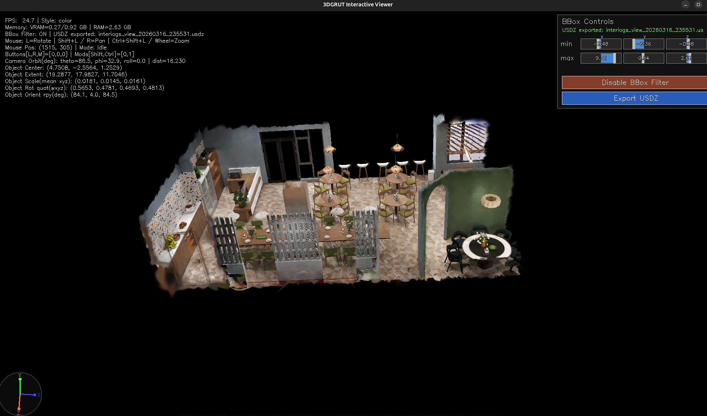
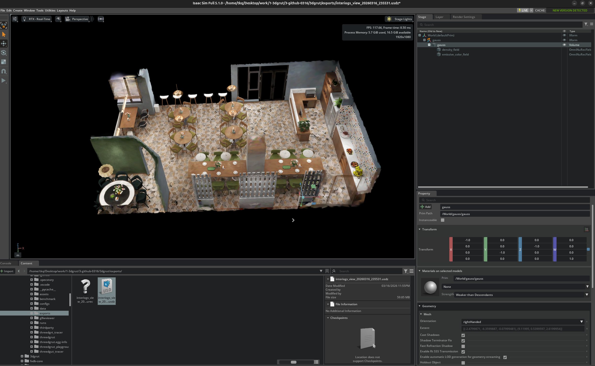

```markdown
# GLFW Viewer (`glfwviewer`)

3DGRUT desktop interactive viewer (GLFW + OpenGL). Supports loading `.ply / .pt / .ingp` Gaussian scenes, real-time interactive browsing, BBox filtering/clipping, and exporting USDZ / NUREC.

---

## Quick Start

```bash
conda activate 3dgrut_cuda12
python glfwviewer/gplayground.py --gs_object <path/to/scene.ply>
```

**Rendered view**



**BBox clipping and exporting OpenUSD**




**Open exported USDZ in Omniverse**

\

## Environment Installation

```bash
# Standard install
./install_env.sh 3dgrut && conda activate 3dgrut

# CUDA 12 variant
CUDA_VERSION=12.8.1 ./install_env.sh 3dgrut_cuda12 WITH_GCC11 && conda activate 3dgrut_cuda12
```

**Key dependencies**

| Dependency | Version |
|---|---|
| `opencv-python` | `<4.12.0` |
| `kaolin` | `==0.17.0` |
| `usd-core` | Required for exporting USDZ |

---

## Features

### Interaction Controls

| Action | Shortcut |
|---|---|
| Rotate | Left-drag |
| Pan | `Shift+Left` or Right-drag |
| Zoom | `Ctrl+Shift+Left` or mouse wheel |
| Camera Roll | `Z` / `X` |
| Copy/Paste Camera Pose | `Ctrl+C` / `Ctrl+V` |
| Toggle Render Style | `S` |
| Toggle HUD | `H` |
| Reset View | `R` |
| Toggle Scene Guide Plane | `G` |
| Quit | `Q` / `ESC` |

### BBox Filtering & Export

- Min/Max sliders (click-drag, double-click to edit text), applied in real time to the density tensor
- Export to USDZ + NUREC, saved into the `exports/` directory alongside the source file
- Includes USD coordinate system correction (alignment for Omniverse / Isaac Sim)

---

## Module Layout

```text
glfwviewer/
├── gplayground.py   # CLI entry
├── viewer.py        # Top-level orchestration, GLFW callback registration
├── render_loop.py   # Main render loop
├── window.py        # GLFW window + OpenGL resources
├── camera.py        # Turntable camera controller
├── interaction.py   # Keyboard and mouse event dispatch
├── hud.py           # HUD / scene guide / BBox control rendering (OpenCV)
├── bbox_panel.py    # BBox UI state machine, bridges to Exporter
├── scene_state.py   # Scene bounds + home view
├── exporter.py      # BBox filtering + USDZ/NUREC export
├── shaders.py       # Fullscreen quad GLSL
└── utils.py         # Math helpers (quaternions / memory formatting)
```

**Architecture layers**: `CLI entry → InteractiveViewer (orchestration) → capability modules → Engine3DGRUT (external engine)`

---
```
